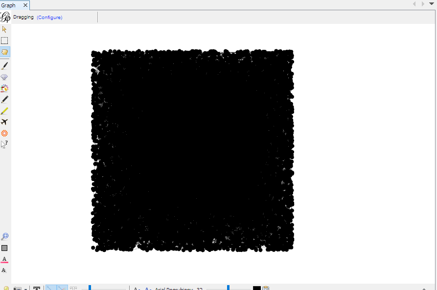
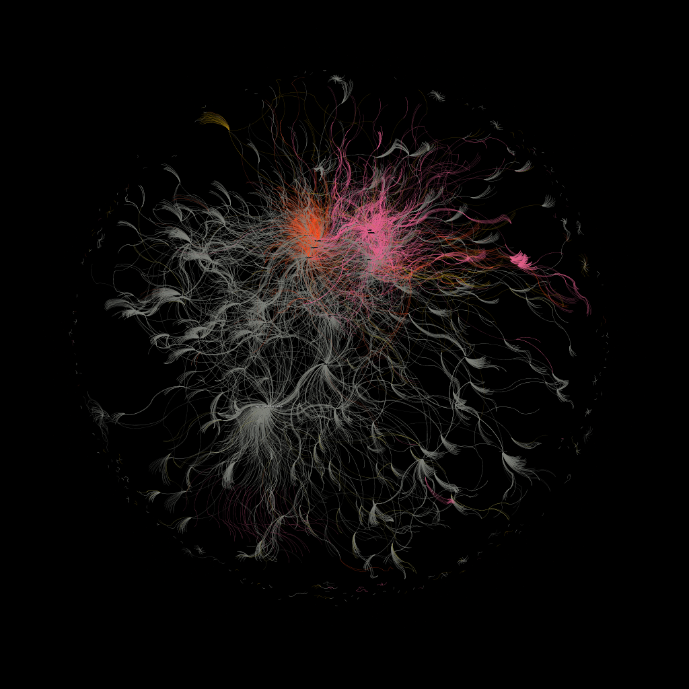
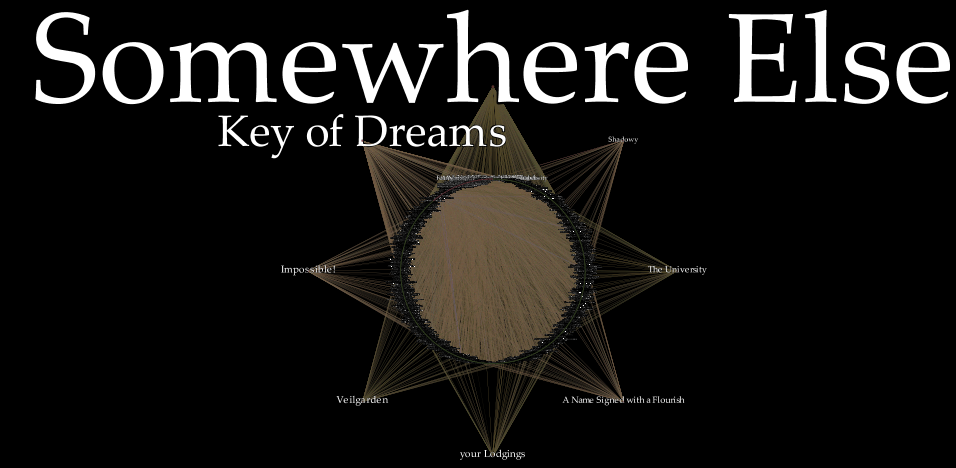
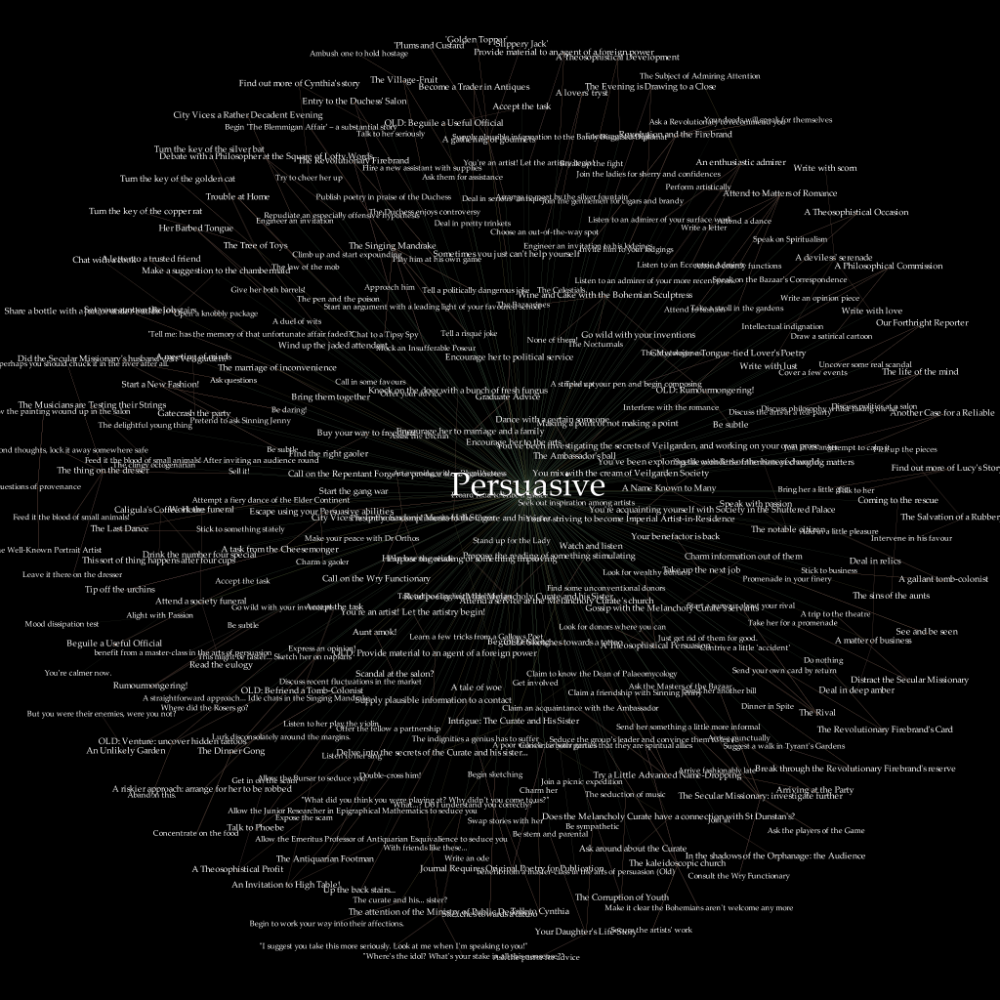
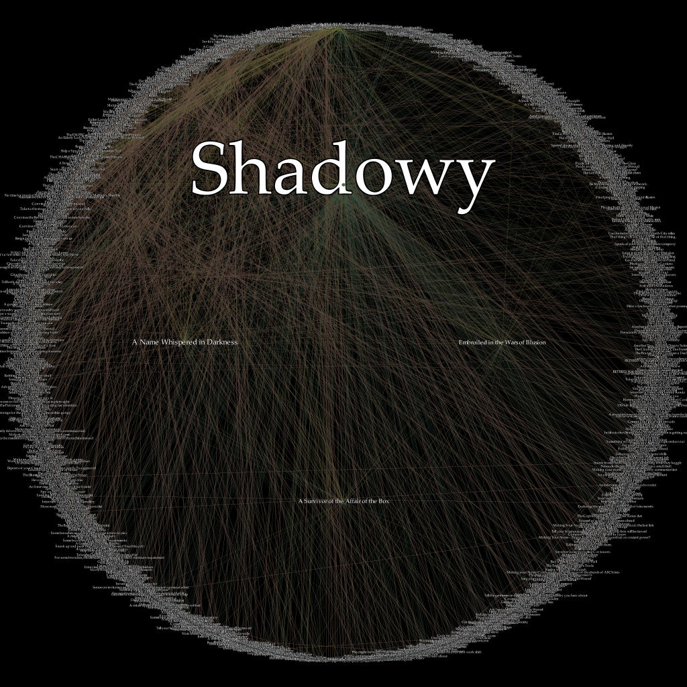
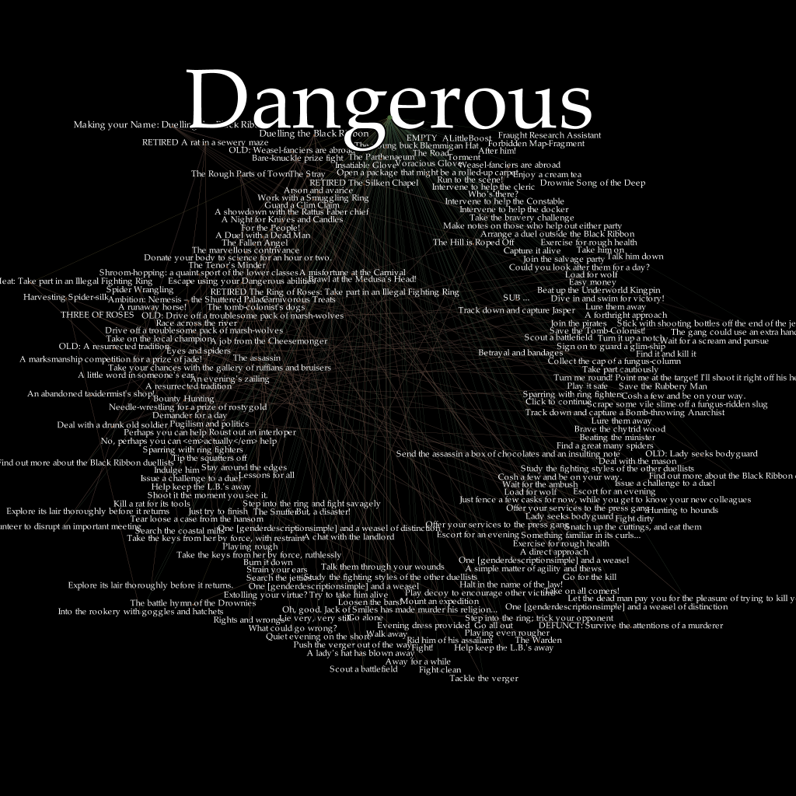
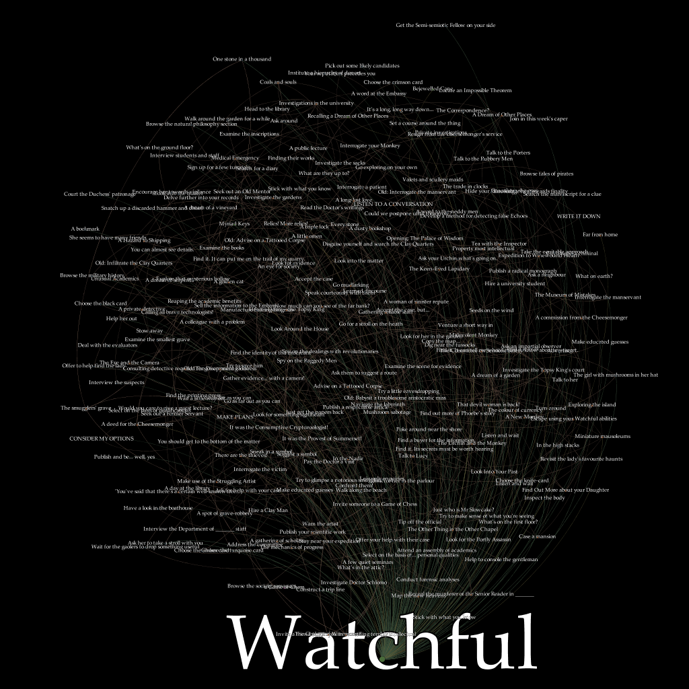
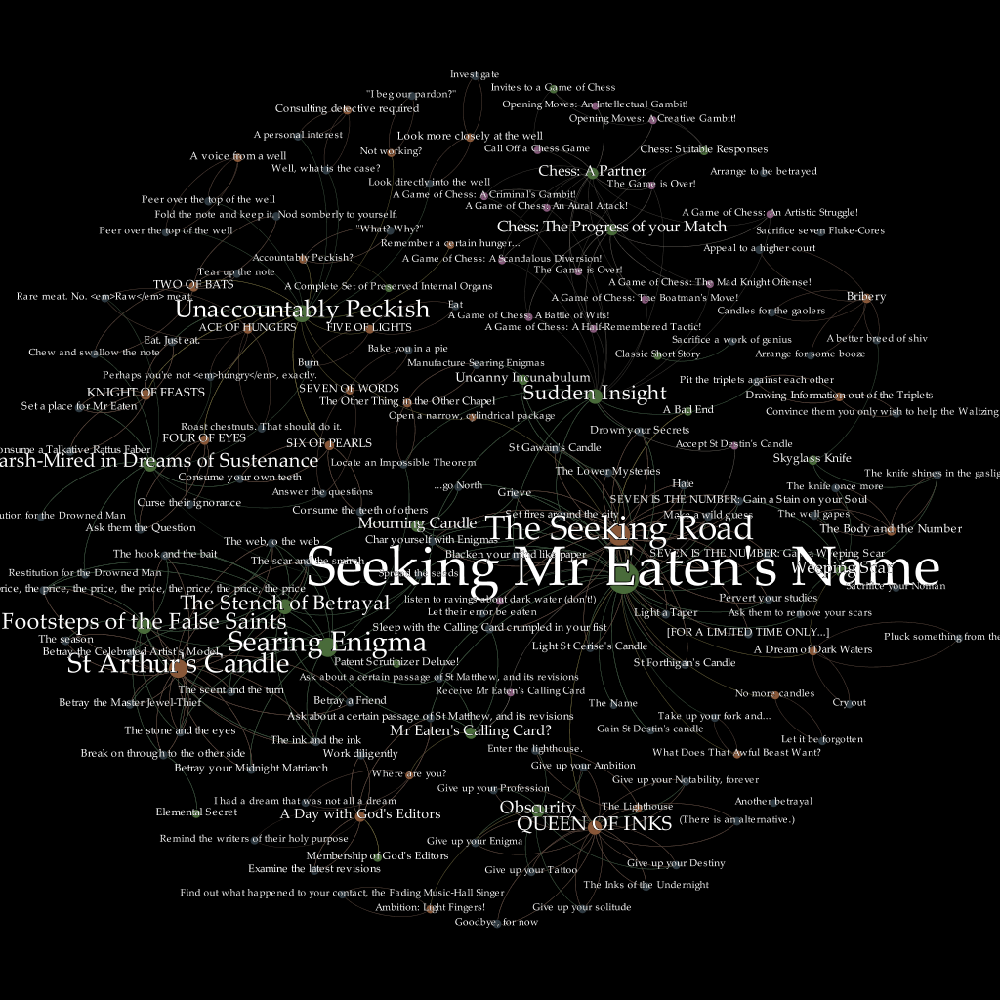

```
7MMF'                                 `7MM                        
  MM                                     MM                        
  MM         ,pW"Wq.  `7MMpMMMb.    ,M""bMM   ,pW"Wq.  `7MMpMMMb.  
  MM        6W'   `Wb   MM    MM  ,AP    MM  6W'   `Wb   MM    MM  
  MM      , 8M     M8   MM    MM  8MI    MM  8M     M8   MM    MM  
  MM     ,M YA.   ,A9   MM    MM  `Mb    MM  YA.   ,A9   MM    MM  
.JMMmmmmMMM  `Ybmd9'  .JMML  JMML. `Wbmd"MML. `Ybmd9'  .JMML  JMML.

             ----------------------
             |&&&&&&&&&&&&&&&&&&&&|
             |&&&&&&&&&&&&/.     *|
             |@@@&&&&&&&&&&@@@&*.%|
             |@@@@@@@@@@@@@@@@@@#.|
             |@@@@@@@@@@@@@@@@#.. |
             |@@@@@@@@@@@@@@@@#.. |
             |&@@@@@@@@@@@@@@@@@#.|
       /----&(&@@@@@@@@@@@@@@@@@,@&----\  
      @&&&&&&&&&&&& &&&&&&&& &&&&&&&&&&&@                         Fallen London
     (%&&&&&&&&&&& ' &&&&&& ' &&&&&&&&&&&)          Reverse Engineering Project
      @&&&&&&&&&&&   &&&&&&   &&&&&&&&&&@
       \-------------------------------/  
               \                */        
                \  / v v v v.\  /
                 \/           \/
                 
              ,,            ,,                  
`7MM\"""Mq.    db            db                                     
  MM   `MM.                                                        
  MM   ,M9  `7MM  ,pP"Ybd `7MM  `7MMpMMMb.   .P"Ybmmm              
  MMmmdM9     MM  8I   `"   MM    MM    MM  :MI  I8                
  MM  YM.     MM  `YMMMa.   MM    MM    MM   WmmmP"                
  MM   `Mb.   MM  L.   I8   MM    MM    MM  8M                     
.JMML. .JMM..JMML.M9mmmP' .JMML..JMML  JMML. YMMMMMb               
                                            6'     dP              
                                            Ybmmmd'     
```

This README is a work in progress. It is also purposefully incomplete
because using the provided tools allows for cheating in an online game.
Full details will be published when the Fallen London mobile application
is disconnected from the game servers.

# Introduction

Can it be true? All the world's knowledge, all the secrets - but no
sacrifice required? Can everything about your existence and all your
possible existences be deciphered from the inhuman languages and their
Words-Behind-Worlds? Is that dusty old tome the real Reverse Engineer's
Journal - and if it is, is it as powerful as they claimed? And perhaps
most importantly: what is the real price of such power?

+ **Shadowy** is increasing...
+ **Watchful** is increasing...
+ You've gained 1x **Reverse Engineer's Journal**
+ You've gained ∞ **Fate**!
+ A twist in your tale! You are now **A Scholar of Words-Behind-Worlds**

# Actual Introduction

Fallen London is a text-based browser MMO. It is set in a very
interesting world and its writing might be among the best in gaming.
Unfortunately, it is a browser MMO so all that good stuff is locked
behind both microtransaction paywalls and endless hours of grinding.
For a more detailed analysis of the game (and other titles set in
the same world), feel free to read
[an article](https://hg101.kontek.net/fallenlondon/fallenlondon.htm)
that I've written for Hardcore Gaming 101 (#TODO: link to a new HG101
site when they migrate that article).

Fortunately for us, we don't have to play the boring game of Fallen
London to learn the interesting story of Fallen London. Instead, we can
play a much more interesting game of reverse engineering. You see, there
was a time when in addition to being a browser-based game, Fallen London
was also a mobile game - and that mobile version was not just a thin
client. With a bit of reverse engineering knowledge (but not too much),
a bit of programming (again, simple stuff), a few good (?) ideas and
a very small dose of entry level graph theory/network analysis, we can
make it reveal all its secrets.

# Something's rotten in London

There are two things about the Fallen London mobile app that should
sound very interesting to anyone with at least a bit of hacking/security
knowledge. The first one is that, even though the game is an MMO, you
can play it offline. The second one is that your energy regenerates
faster in the mobile version than in the browser version, even though
they use the same servers (you can make a character through a browser
interface, play for a while, and then log in to the same character from
mobile and play some more). This means that at least some parts of
the game are implemented **client-side**, and the cool thing about
things that happen on the client side is that you can actually control
them.

Here's how it works: when you start the app and log in, the app requests
updates from the game servers. The server can send updates to images,
database (more on that later: it's an important part) and player data
(player data is represented as JSON). The app stores gameplay
information as you're playing and when you quit it, it makes a JSON with
all that data and sends it back to the servers. This is referred to as
'syncing'. Everything between those syncs is client-side - and
the players knew that for a long time, even though they might not have
grasped the full implications of such design: players have been known to
cheat in the game by force-stopping the app after a failed random check,
and then repeatedly trying again until a desired outcome is reached.
This has been an open secret for quite some time, and people have been
banned for it:
[here's](http://community.failbettergames.com/topic24836-possibly-the-first-paramount-presence.aspx)
a thread about the first player to achieve the 'Paramount Presence'
status (all main stats maxed out) being exposed as a cheater.

The fact that this mobile app allows cheating is quite obvious, given
its design. In fact, it is possible to develop more sophisticated cheats
which don't require manual force-stopping, and here we'll briefly
discuss one of them (although only after the app is disconnected from
the servers). There is something far more interesting than those cheats
though: if the game allows offline play, it needs to store at least some
of its content on the client side (spoiler alert: it stores all of it).
As reading Fallen London is superior to playing Fallen London, this
content is what we're looking for.

# Extracting game data

[THIS PARAGRAPH IS INTENTIONALLY LEFT BLANK.]

Check back after the mobile app closes.

# Graphing the Neath

## From JSON-in-SQLite to NetworkX to GEXF

The decrypted database contains more or less the entire design of
the game. There's just one problem with that: we have no convenient way
of exploring it. Sure, we have a readable SQLite - but the game data
isn't really described in a relational way so it's not very useful. You
see, there are no foreign keys here. It's JSONs with ID fields that
refer to ID fields of other JSONs when they want to make a reference.
It's like a second database inside the first one.

Speaking of references, there are a lot of those. Most of the in-game
objects contain, are contained by or in other ways connect to other
objects. One-to-one, one-to-many and many-to-one relations all exist in
here - and to understand what's going on, we need a way to easily follow
the links. Pulling the 'internal database', figuring out its structure
and turning into actual, well-designed relational DB might be a good
idea if we wanted to make our own version of the game and cared about
performance but such a structure would be quite tedious to explore
interactively as we attempt to untangle Fallen London's narrative.

Given that Fallen London can be thought of as a hypertext game,
a natural representation might be **H**ypertext **M**arkup **L**anguage.
I of course reject this perfectly sane solution because I'd like
something easier to manipulate in an automated fashion (the dataset is
big so we want to reduce the tedium as much as possible).

Because Fallen London can be though of as a hypertext, a hypertext can
be thought of as a graph and JSONs in the database can be thought of as
a second database, my first thought is to use a graph database like
Neo4J. Unfortunately, there seems to be no Neo4J (or similar) equivalent
to SQLite that can be stored in a single file. They all need to be set
up as a server, which I feel is just not worth the trouble as it more or
less guarantees that nobody reading this will want to waste time on
that - and what good is a reversing writeup if the readers can't be
bothered to follow it?

In what in retrospect might not be such a good decision, I decide to
drop the 'database' part of 'graph database' and just store everything
as a graph that can be then accessed by graph exploration and network
analysis software. I use the NetworkX library to represent game data as
nodes and edges, write the fl_types module to tell it how to convert
different types of game objects and then dump the output to GEXF format
(it's based on XML because of course it is).

## Working with Gephi: the big graphs

I do a bit of research about open-source network analysis tools and go
for Gephi. It has a Python scripting plugin, it's
[aesthetic as hell](https://player.vimeo.com/video/9726202) and it has
already been used in some interesting narrative network analysis
projects - e.g. Andrew Beveridge's
[Network of Thrones](https://www.macalester.edu/~abeverid/thrones.html)
which used it to analyze the relations between the characters in A Song
Of Ice and Fire novel series. What could possibly go wrong?

Well, for the starters, Gephi just can't read my GEXF. It claims that
some node or edge ID is null, even though it isn't. Googling reveals
this to be
[a known problem for large files](https://github.com/gephi/gephi/issues/1841).
Because as of writing it haven't yet been fixed, I modify my scripts
a bit to ignore some objects and to treat some references as if they
were attributes, thus limiting the number of nodes and edges. This
works, and we're given this beautiful representation of game data:



I play around with colors a little bit (I color the nodes based on
partition->type, with a custom palette generated from
'Fancy (dark background)' preset), set the sizes of the nodes based on
their indegree, make the background black and then try to find a decent
layout. Unfortunately, most of the layouts either result in a huge mess
or take forever to generate - both of those problems arising due to
the size of my graph. Really, the only one that is even remotely useful
here is 'Open Ord'.

I also make labels for each node based on the 'Name'
attribute and scale their size based on indegree. I display them in
a nice Palatino font (I think Failbetter uses Adobe's Trajan Pro 3 but
I don't have money for it). Unfortunately, you can't really see much of
the text in this image - but if you look hard enough, you'll see
the words 'Key of Dreams'. That's a quality which
[only the developer accounts have](http://community.failbettergames.com/topic21866-what-is-the-key-of-dreams.aspx),
and setting it as a required quality for something blocks it for normal
users. This means that there's a lot of such locked content in the game
(other quality used for locking is 'Impossible'; it's also required for
a lot of things).



After trimming the graph a little bit (I removed things which don't have
a 'type' attribute - as they're result of some kind of a bug - with
Filters->Library->Attributes->Non-null->type (Attribute); I also removed
things that are not connected to the main graph with
Filters->Library->Topology->Giant Component). Then, I used the Dual
Circle layout, made 8 upper order nodes based on the indegree and placed
them outside of the main circle. This gave us this cool-looking star:



As you see, the locations ('Somewhere else', 'Veilgarden',
'your Lodgings', 'The University') are connected to many other things.
In subsequent analysis, this made isolating graphs for specific
questlines in an automated way difficult so I modified a script to
ignore them so that most edges would connect events and qualities.

## Using modularity to find related content

Calculating modularity is one of the methods of (non-overlapping)
community detection. Nodes within those communities will be densely
connected with each other but sparsely connected to the rest of
the graph. As a result, a graph will be effectively divided into
subgraphs.

Modularity is useful to us: a group of interconnected events, qualities,
branches etc. is highly indicative of a discrete storyline.
Unfortunately, this isn't so simple in practice: the algorithm tends to
create both large communities that would be better off split up into
smaller sections and micro-communities of 2 or 3 nodes that don't tell
us much. Finding desired results will require a lot of manual tweaking.

To run the algorithm, use Statistics->Network Overview->Modularity. You
can then filter the graph by detected community with
Filters->Library->Attributes->Partition->Modularity Class.

With the modularity algorithm, we can find content related to our
playable character's main stats. This is nice, but it also reveals how
the presence of such 'popular' vertices distorts our results a bit:
'those things are all related to your persuasion skill' is a very broad
strokes connection when this skill is connected to (more or less) one
fourth of the game's content.









But, as I said, with a bit of tweaking, you can find what you're looking
for. Here's a graph representing the game's infamously difficult quest
called 'Seeking Mr Eaten's Name'. We're digging into the game's secrets
here: this is basically Fallen London's endgame, and very few players
have finished it.



Keep in mind that the modularity algorithm is just a heuristic: while
most of the things you see here are related to SMEN, I don't think that,
for example, 'A Game of Chess' (one of the game's sort-of-PVP
components) has anything to do with it.